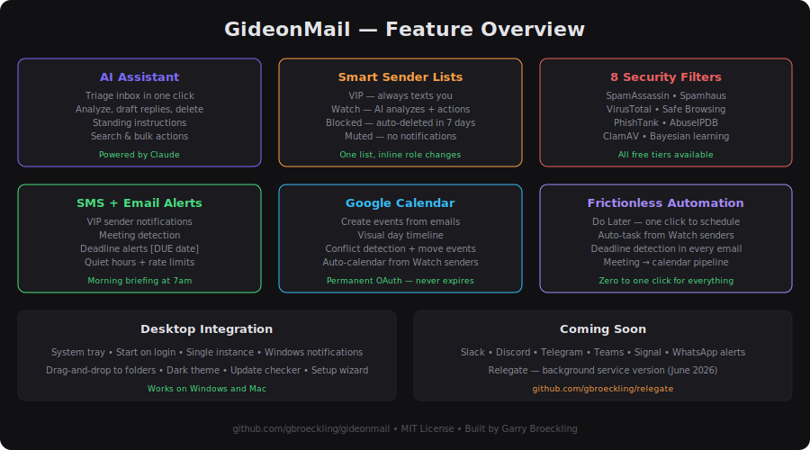

# GideonMail

### AI-powered desktop email client for IMAP/SMTP

GideonMail is a focused, privacy-first email client built for people who run their own mail servers. It connects to a single IMAP/SMTP account and adds what traditional email clients don't: an AI assistant that reads, triages, and acts on your email — plus SMS alerts, Google Calendar integration, and smart sender management.

No cloud sync. No telemetry. No account linking. Everything runs locally.

> **Coming June 1:** [Relegate](https://github.com/gbroeckling/relegate) — the background service version of GideonMail. Same AI engine, no desktop UI, runs on boot. GideonMail is the testing ground for every Relegate feature.



### [Download for Windows](https://github.com/gbroeckling/gideonmail/releases/latest) | [Mac: clone + npm start](#quick-start)

---

## Why GideonMail?

Most email clients handle mail. GideonMail manages it.

- You get a **text message** when someone important emails you
- Your **AI assistant** triages your inbox, drafts replies, deletes spam, and creates calendar events
- **Security filters** scan every email from unknown senders
- **Smart sender lists** control who triggers alerts, who gets blocked, and who gets analyzed
- **Meeting detection** finds calendar-worthy emails and queues them for you

All from a lightweight Electron app that sits in your system tray.

---

## Features

### Core Email
- Single IMAP/SMTP account (ISPConfig, Dovecot, Postfix, Zimbra, etc.)
- Folder browsing with drag-and-drop to move emails
- HTML email rendering in a sandboxed iframe
- Compose with rich text — reply, reply all, forward
- File attachments (send and download)
- Full-text search (subject, from, to, body)
- Star/flag messages
- Links open in your default browser

### AI Assistant (Claude)
- **Triage** — AI reviews your inbox and prioritizes every email
- **Analyze** — one-click summary of any open email with suggested actions
- **Draft Reply** — AI writes a reply matching the tone of the conversation
- **Chat** — conversational assistant with full email context
- **Email Actions** — AI can forward, reply, delete, flag, search, and bulk-delete
- **Standing Instructions** — persistent rules the AI follows on every check (e.g., "always flag emails from my accountant")
- **Save as Instruction** — liked what the AI did? One click to make it a permanent rule

### Smart Sender Management (People)
One unified list for all your sender rules:
- **VIP** — always texts you, white highlight in inbox, spam filters skipped
- **Watch** — AI analyzes every email, configurable actions (SMS, auto-calendar, flag)
- **Blocked** — dark red in inbox, auto-deleted after 7 days, always spam-filtered
- **Muted** — grey in inbox, no notifications, spam filters skipped
- Change roles inline with a dropdown — no removing and re-adding
- Add senders from the "Add sender to..." dropdown on any open email

### SMS Notifications (Textbelt)
- VIP sender alerts with AI-generated summaries
- Meeting detection — "MEETING from Nicole: Dinner Friday 7pm"
- Conversation alerts — texts you when someone replies to a thread you've been active in
- Configurable: message format, quiet hours (10pm–7am), rate limits, batch mode
- History lookback — catches emails that arrived while app was closed

### Google Calendar Integration
- **Task button** on any email — AI extracts date, time, location, attendees
- **Visual day timeline** — see your schedule with the proposed event highlighted
- **Conflict detection** — overlapping events shown in red
- **Attendee approval** — detected attendees shown for your approval before inviting
- **Meeting detection** — VIP emails that look like meetings get queued as pending appointments
- **Auto-calendar** — Watch list senders can auto-create events (no invites sent)
- Permanent OAuth with refresh tokens — stays connected

### Security Filters
8 toggleable filters (Rules → Security tab):
- **SpamAssassin Headers** — reads existing server-side spam scores
- **Spamhaus ZEN** — DNS blocklist for sender IP (free)
- **VirusTotal** — scans URLs against 70+ antivirus engines (free tier)
- **Google Safe Browsing** — URL threat check (free tier)
- **PhishTank** — phishing URL database (free)
- **AbuseIPDB** — sender IP reputation (free tier)
- **ClamAV** — local antivirus for attachments (free, requires install)
- **Built-in Bayesian** — learns from your delete/flag actions over time

VIP, Watch, and Muted senders are immune from spam filters. Only Blocked and unknown senders get scanned.

### Desktop Integration
- System tray with unread count
- Start on Windows login (minimized to tray)
- Single instance lock — no duplicate tray icons
- Windows notifications for meeting detection and auto-calendar events
- Close dialog: "Minimize to Tray" or "Quit"
- Desktop shortcut creator

### UI
- Modern 2026 dark theme (charcoal + indigo-violet accent)
- Three-pane layout (folders / message list / read pane)
- Sender status badges on emails (VIP, WATCH, BLOCKED, MUTED)
- Color-coded message list by sender role
- Setup wizard on first launch
- Help button re-opens setup guide anytime

---

## Quick Start

```bash
git clone https://github.com/gbroeckling/gideonmail.git
cd gideonmail
npm install
npm start
```

The setup wizard walks you through connecting your email, AI, SMS, and calendar.

---

## Requirements

- **Node.js 18+** and npm
- An IMAP/SMTP email account
- Windows 10/11 (Electron supports macOS/Linux but tested on Windows)

### Optional services (all free tiers available)
- [Anthropic API](https://console.anthropic.com) — AI assistant (~$0.003/email, ~$40/year for a busy account)
- [Textbelt](https://textbelt.com) — SMS notifications ($10/1000 texts)
- [Google Calendar API](https://console.cloud.google.com) — calendar integration (free)
- [VirusTotal](https://www.virustotal.com) — URL/attachment scanning (free tier)
- [AbuseIPDB](https://www.abuseipdb.com) — IP reputation (free tier)

---

## Documentation

| Guide | Description |
|-------|-------------|
| [Setup Guide](docs/SETUP.md) | First-run setup: email, AI, SMS, calendar |
| [API Setup](docs/API-SETUP.md) | Step-by-step for each API key |
| [Features Guide](docs/FEATURES.md) | Complete feature reference |
| [Security](docs/SECURITY.md) | Security architecture and filters |
| [Architecture](docs/ARCHITECTURE.md) | Technical architecture |

---

## Architecture

```
main.js            Electron main process: IMAP, SMTP, AI, SMS, calendar, security
preload.js         IPC bridge (contextIsolation: true)
renderer/
  index.html       UI structure: sidebar, panes, modals, wizard
  styles.css       2026 dark theme with CSS variables
  app.js           UI logic: message list, compose, AI panel, rules, wizard
security.js        8 security filter implementations
google-auth.js     OAuth 2.0 with refresh tokens
assets/            Icons (target + arrow, multiple sizes)
```

All email processing, AI calls, and security scanning happen in the main process. The renderer communicates via IPC through a secure preload bridge. Email HTML is rendered in a sandboxed iframe. No `nodeIntegration`, full `contextIsolation`.

---

## Development

```bash
npm start        # launch the app
npm run dev      # launch with verbose logging
```

Built by **Garry Broeckling**. Implementation is AI-assisted using **Claude** by Anthropic — all architecture, product decisions, and testing are human-directed.

---

## License

MIT — see [LICENSE](LICENSE).

Copyright (c) 2026 Garry Broeckling.
